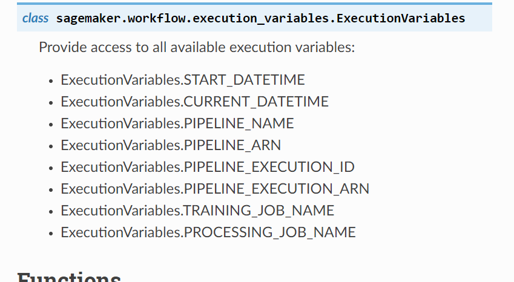
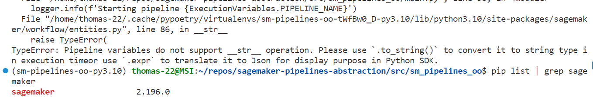

# Shortcomings

## Unclear types (from docs *and* source code)

### Boto3 does not support type checking out of the box

Fortunately there is a [3rd party package of type stubs](https://pypi.org/project/mypy-boto3-sagemaker/), but you have to know about it and install it separately. Also, this introduces the potential for errors if there is a version mismatch between boto3 and boto3-stubs.

### There is no easy way of type-checking Sagemaker SDK

This is because [it does not implement PEP 561](https://github.com/aws/sagemaker-python-sdk/issues/2985). What makes this particularly frustrating is that the Sagemaker SDK's code base *is*in fact already typed, but mypy can't use these types because the package is missing an (empty) py.typed file that would mark it as annotated.

Looks like while there are some workaround, they seem too hacky for production-grade software.

### Pipeline Execution Variables

Unfortunately, the docs[https://sagemaker.readthedocs.io/en/v2.200.1/workflows/pipelines/sagemaker.workflow.pipelines.html#execution-variables] are not useful in telling us how to use it (e.g., which methods we can call on it)

In other parts of the docs, this class is mentioned as an arg type (e.g., for Conditionstep). However, this is not linked here.
Even more importantly, we have to guess how else we can use it, .e.g., could we print it in logs? You would assume so, but in fact printing fails because it turns out that this class only has a to_string() method, but lacks the conventional \_\_str\_\_() method.

At least the error message tells you how to fix it, but it would be better if we could find this out before runtime. (In addition,  to_string() should simply be renamed to the standard \_\_str\_\_().).

(Also remember it is hard to play with this coe interactively and simply call \_\_dir\_\_() on an instance, because this code only runs in a pipeline.)

Note: **The reason this problem is also not caught by the type checker is because of the library's missing py.typed marker discussed above, which leads mypy to skip it!**
