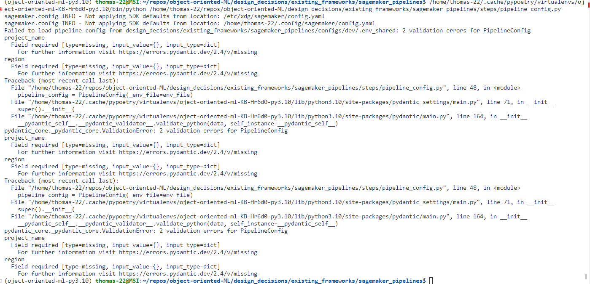
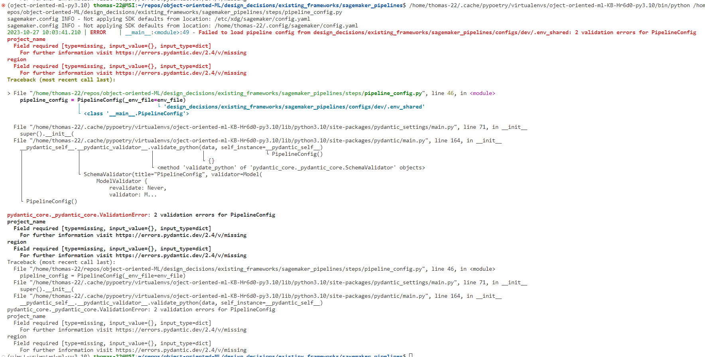

# Best practices

- *centralized* logging
- *structured* logging (JSON rather than plaintext, because it is machine-readable, and can be parsed much more cheaply)
- Generally it's best to log to stdout rather than a file, and let a log aggregation tool (e.g., Grafana Loki) handle the rest. Usually, there is no need to configure stuff like log rotation, compression, etc. from Python.

# Python libraries

- The main competitors are the standard library's logging module, or the third-party modules structlog, python-json-logger, and loguru. For custom use cases, the combination of structlog plus python-json logger may be best, but in general I think **loguru is the best choice** because of its simplicity. It almost makes the standard library's logger redundant, because it is not just more powerful but also simpler.

## Loguru

- Makes it easy to log as JSON.
- Uses the better-exceptions library under the hood to make logs easier to read. Here is an example of the default output from the standard library's logging module:

By contrast, this is how the output from Loguru looks like:

I think it's clear that the latter is much easier to read! (Note that both are in Python3.10, it's possible that the differences are smaller from Python3.11 onwards because of the improvements to Python's exception formatting.)
